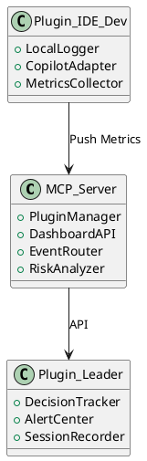

# Proposta de Pesquisa

## Hipótese

O uso de uma infraestrutura MCP com plugins especializados **melhora significativamente a capacidade de liderança técnica em ambientes projetizados**, permitindo maior antecipação de riscos, maior rastreabilidade de decisões, e acompanhamento mais preciso do progresso técnico dos projetos e dos desenvolvedores.

## Plano de Pesquisa

### Título do Projeto

**"Infraestrutura MCP Inteligente para Apoio à Liderança Técnica em Engenharia de Software Baseada em Projetos"**

### Objetivo Geral

Projetar, implementar e avaliar uma infraestrutura MCP com arquitetura baseada em plugins inteligentes para apoio contínuo à liderança técnica em ambientes de software projetizados.

### Objetivos Específicos

- Revisar criticamente a literatura sobre suporte à liderança técnica na engenharia de software;
- Modelar arquitetonicamente um servidor MCP orientado a observabilidade técnica e comportamental;
- Desenvolver plugins locais e centrais com integração a LLMs (ex.: Copilot);
- Aplicar a solução em estudo de caso com múltiplos times;
- Medir os impactos da solução em métricas definidas;
- Analisar e discutir as contribuições técnicas e científicas do artefato proposto.

### Metodologia

- Revisão sistemática da literatura (Kitchenham, 2004);
- Design Science Research (Hevner, 2004);
- Estudo de caso múltiplo com análise qualitativa e quantitativa;
- Validação com método de triangulação de dados (dados instrumentados, entrevistas e logs).

### Esboço de cronograma Macro

| Período | Atividade                                 |
| :------ | :---------------------------------------- |
| M1–M3   | Revisão e planejamento detalhado          |
| M4–M6   | Desenvolvimento do núcleo MCP + 1º plugin |
| M7–M9   | Integração com Copilot + aplicação piloto |
| M10–M12 | Coleta e análise de resultados            |

---

## Esboço inicial dos componentes da Arquitetura Proposta

### Descrição dos Componentes

- **MCP_Server**: Servidor central, responsável por orquestrar eventos e exibir dashboards para o líder técnico.
- **Plugin_IDE_Dev**: Instalado localmente na IDE do desenvolvedor. Captura eventos, interações com Copilot e métricas de contexto.
- **Plugin_Leader**: Interface do líder técnico com relatórios, alertas e registro de decisões técnicas.

---

## Esboço inicial do Plano de Implementação (Sprints)

| Sprint   | Período       | Objetivo                                  | Entregável                              |
| :------- | :------------ | :---------------------------------------- | :-------------------------------------- |
| Sprint 1 | Maio/2025     | Definir MVP da arquitetura                | Documento arquitetural + backlog        |
| Sprint 2 | Junho/2025    | Construir núcleo do MCP                   | Protótipo servidor pluginável           |
| Sprint 3 | Julho/2025    | Criar plugin de reunião + decisão técnica | Plugin funcional + testes locais        |
| Sprint 4 | Agosto/2025   | Integrar plugin de IDE com Copilot        | Plugin + adaptação à API GitHub Copilot |
| Sprint 5 | Setembro/2025 | Criar dashboard de alertas + visualização | Painel para líder técnico               |
| Sprint 6 | Outubro/2025  | Início dos testes com time real           | Logs e coleta parcial de evidências     |

## Operacionalização da Hipótese

A hipótese será testada empiricamente por meio de indicadores como:
- Redução do tempo médio gasto pelo líder técnico na geração de relatórios técnicos semanais;
- Aumento da detecção precoce de riscos técnicos com base em alertas emitidos por plugins;
- Percepção de melhoria na rastreabilidade de decisões técnicas (coletada via entrevistas);
- Aderência das equipes às boas práticas automatizadas pelo servidor MCP;
- Qualidade técnica evolutiva observada nos repositórios dos projetos monitorados.

## Premissas e Assunções

- A organização adota repositórios versionados (GitHub, GitLab);
- Há reuniões técnicas semanais com decisões registráveis;
- Os times estão abertos a integrar a ferramenta MCP como infraestrutura de apoio;
- O líder técnico está disponível para validar e usar a ferramenta de forma progressiva;
- A pesquisa poderá observar ao menos dois ciclos completos de projeto.

Do ponto de vista acadêmico, a pesquisa contribui com o avanço do conhecimento em:
- Engenharia de software orientada à liderança técnica;
- Automação de governança técnica com infraestrutura leve e customizável;
- Instrumentação de papéis humanos críticos na engenharia de software;
- Convergência entre práticas ágeis, arquitetura viva e rastreabilidade.