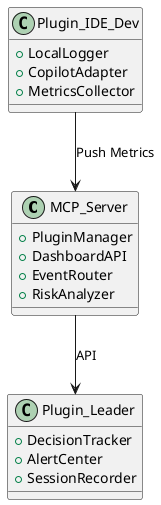

# Proposta de Pesquisa

## Seção 1: Motivação

O líder técnico em empresas de inovação atua como **guardião técnico** e **formador de cultura**, sendo responsável por guiar equipes, proteger a inovação e garantir a qualidade técnica contínua dos produtos. Sua missão é sustentar a coerência técnica dos projetos enquanto viabiliza a evolução ágil e sustentável dos times e das soluções entregues.

A atuação da liderança técnica pode ser organizada segundo cinco dimensões principais:

| Dimensão                          | Responsabilidade                                                                                  |
| :-------------------------------- | :------------------------------------------------------------------------------------------------ |
| **Gestão técnica de times**       | Garantir qualidade técnica, coerência das soluções e viabilizar inovação prática.                 |
| **Disseminação e boas práticas**  | Criar, treinar e sustentar padrões de excelência técnica (clean code, testes, arquitetura limpa). |
| **Formação de pessoas e times**   | Desenvolver talentos, construir lideranças futuras e guiar crescimento técnico do grupo.          |
| **Acompanhamento contínuo**       | Supervisionar evolução de projetos, códigos, testes, riscos técnicos e saúde arquitetural.        |
| **Visão arquitetural e inovação** | Manter visão sistêmica de longo prazo sem comprometer agilidade nem criatividade.                 |

No dia a dia, essa atuação se materializa em tarefas recorrentes como:
- Acompanhamento semanal do time;
- Verificação das metas da sprint;
- Análise da evolução individual dos desenvolvedores;
- Inspeção da evolução do código (semanal e longitudinal);
- Identificação de riscos técnicos;
- Acompanhamento da qualidade dos testes;
- Manutenção da visão arquitetural frente a alterações contínuas.

Contudo, realizar todas essas atividades de maneira manual é ineficiente, exige alto esforço cognitivo e tende a comprometer a escalabilidade da atuação da liderança técnica. Em organizações onde múltiplos projetos e equipes coexistem, torna-se imperativo automatizar a coleta, análise e visualização de informações críticas para a tomada de decisão técnica.

### Oportunidade: Servidor MCP como infraestrutura de apoio técnico modular

A recente consolidação de arquiteturas baseadas em **MCPs (Model Context Protocols)**, com servidores modulares e plugins acopláveis, cria a possibilidade de implementar uma **infraestrutura viva de monitoramento técnico**. Em vez de depender exclusivamente do esforço manual do líder técnico, seria possível acoplar **plugins especializados**, cada um responsável por uma dimensão da governança técnica.

| Plugin                          | Função principal                                                                     | Tipo de primitivo MCP |
| :------------------------------ | :----------------------------------------------------------------------------------- | :-------------------- |
| **Weekly Meeting Tracker**      | Registro estruturado e sumarização automática de reuniões técnicas                   | Resources + Prompts   |
| **Sprint Goal Tracker**         | Coleta de metas atingidas, bloqueios e pendências da sprint                          | Resources             |
| **Developer Progress Tracker**  | Acompanhamento técnico individual com base em PRs, feedbacks e revisões              | Resources + Tools     |
| **Code Evolution Monitor**      | Análise da evolução do repositório: complexidade, hotspots, padrões de refatoração   | Resources + Tools     |
| **Risk Detection Module**       | Identificação automática de padrões de risco técnico emergente                       | Tools                 |
| **Test Coverage Tracker**       | Acompanhamento da cobertura de testes, evolução dos cenários e regressões            | Resources + Tools     |
| **Architecture Drift Detector** | Análise de divergências em relação à arquitetura planejada (acoplamentos, violações) | Tools                 |

Esses plugins podem ser combinados de forma incremental conforme as necessidades da organização, apoiando o líder técnico de maneira contínua, com alertas, dashboards e relatórios gerados automaticamente. Isso permite sustentar decisões técnicas mais bem embasadas e alinhar múltiplas equipes com maior precisão e autonomia.

### Hipótese

O uso de uma infraestrutura MCP com plugins especializados **melhora significativamente a capacidade de liderança técnica em ambientes projetizados**, permitindo maior antecipação de riscos, maior rastreabilidade de decisões, e acompanhamento mais preciso do progresso técnico dos projetos e dos desenvolvedores.

### Operacionalização da Hipótese

A hipótese será testada empiricamente por meio de indicadores como:
- Redução do tempo médio gasto pelo líder técnico na geração de relatórios técnicos semanais;
- Aumento da detecção precoce de riscos técnicos com base em alertas emitidos por plugins;
- Percepção de melhoria na rastreabilidade de decisões técnicas (coletada via entrevistas);
- Aderência das equipes às boas práticas automatizadas pelo servidor MCP;
- Qualidade técnica evolutiva observada nos repositórios dos projetos monitorados.

### Premissas e Assunções

- A organização adota repositórios versionados (GitHub, GitLab);
- Há reuniões técnicas semanais com decisões registráveis;
- Os times estão abertos a integrar a ferramenta MCP como infraestrutura de apoio;
- O líder técnico está disponível para validar e usar a ferramenta de forma progressiva;
- A pesquisa poderá observar ao menos dois ciclos completos de projeto.

Do ponto de vista acadêmico, a pesquisa contribui com o avanço do conhecimento em:
- Engenharia de software orientada à liderança técnica;
- Automação de governança técnica com infraestrutura leve e customizável;
- Instrumentação de papéis humanos críticos na engenharia de software;
- Convergência entre práticas ágeis, arquitetura viva e rastreabilidade.

---

## Seção 2: Plano de Pesquisa

### Título do Projeto

**"Infraestrutura MCP Inteligente para Apoio à Liderança Técnica em Engenharia de Software Baseada em Projetos"**

### Objetivo Geral

Projetar, implementar e avaliar uma infraestrutura MCP com arquitetura baseada em plugins inteligentes para apoio contínuo à liderança técnica em ambientes de software projetizados.

### Objetivos Específicos

- Revisar criticamente a literatura sobre suporte à liderança técnica na engenharia de software;
- Modelar arquitetonicamente um servidor MCP orientado a observabilidade técnica e comportamental;
- Desenvolver plugins locais e centrais com integração a LLMs (ex.: Copilot);
- Aplicar a solução em estudo de caso com múltiplos times;
- Medir os impactos da solução em métricas definidas;
- Analisar e discutir as contribuições técnicas e científicas do artefato proposto.

### Metodologia

- Revisão sistemática da literatura (Kitchenham, 2004);
- Design Science Research (Hevner, 2004);
- Estudo de caso múltiplo com análise qualitativa e quantitativa;
- Validação com método de triangulação de dados (dados instrumentados, entrevistas e logs).

### CEsboço de ronograma Macro

| Período | Atividade                                 |
| :------ | :---------------------------------------- |
| M1–M3   | Revisão e planejamento detalhado          |
| M4–M6   | Desenvolvimento do núcleo MCP + 1º plugin |
| M7–M9   | Integração com Copilot + aplicação piloto |
| M10–M12 | Coleta e análise de resultados            |

---

## Seção 3: Esboço inicial dos componentes da Arquitetura Proposta

### Descrição dos Componentes

- **MCP_Server**: Servidor central, responsável por orquestrar eventos e exibir dashboards para o líder técnico.
- **Plugin_IDE_Dev**: Instalado localmente na IDE do desenvolvedor. Captura eventos, interações com Copilot e métricas de contexto.
- **Plugin_Leader**: Interface do líder técnico com relatórios, alertas e registro de decisões técnicas.

---

## Seção 4: Esboço inicial do Plano de Implementação (Sprints)

| Sprint   | Período       | Objetivo                                  | Entregável                              |
| :------- | :------------ | :---------------------------------------- | :-------------------------------------- |
| Sprint 1 | Maio/2025     | Definir MVP da arquitetura                | Documento arquitetural + backlog        |
| Sprint 2 | Junho/2025    | Construir núcleo do MCP                   | Protótipo servidor pluginável           |
| Sprint 3 | Julho/2025    | Criar plugin de reunião + decisão técnica | Plugin funcional + testes locais        |
| Sprint 4 | Agosto/2025   | Integrar plugin de IDE com Copilot        | Plugin + adaptação à API GitHub Copilot |
| Sprint 5 | Setembro/2025 | Criar dashboard de alertas + visualização | Painel para líder técnico               |
| Sprint 6 | Outubro/2025  | Início dos testes com time real           | Logs e coleta parcial de evidências     |

